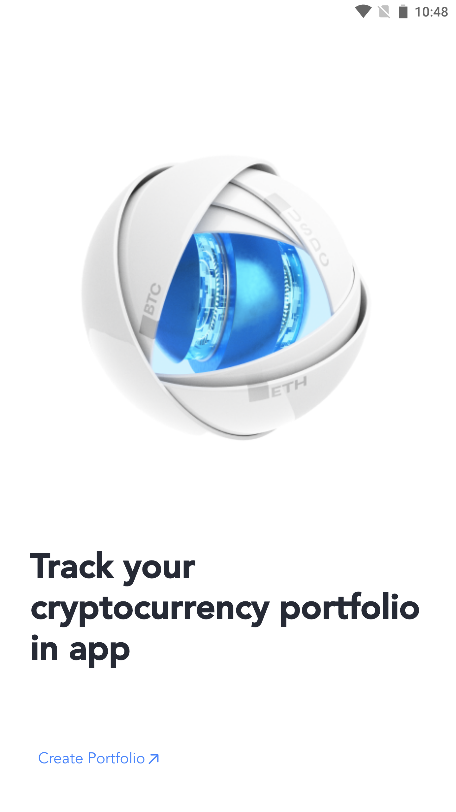
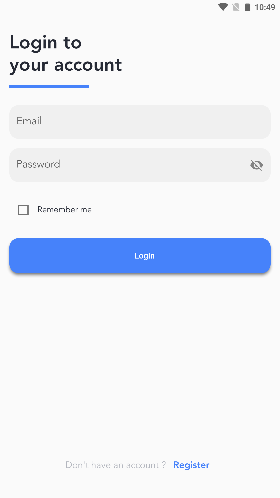
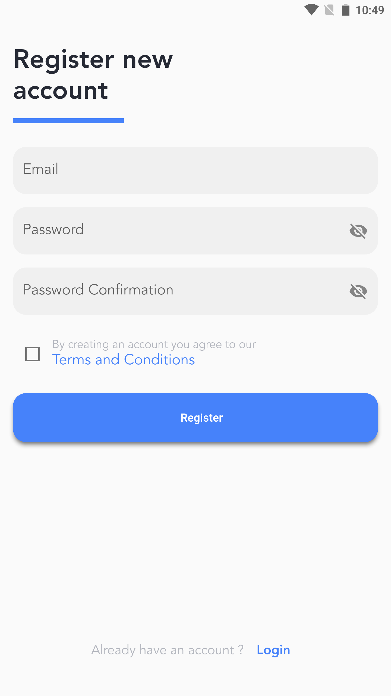
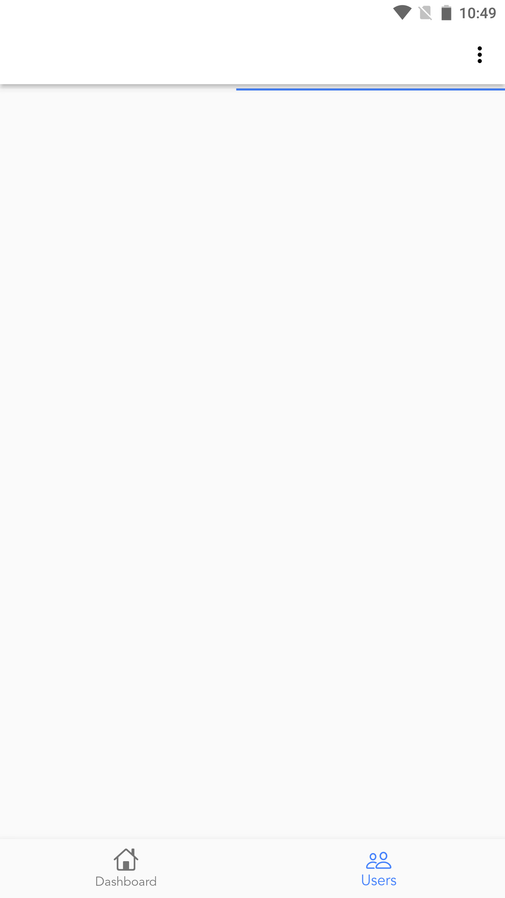
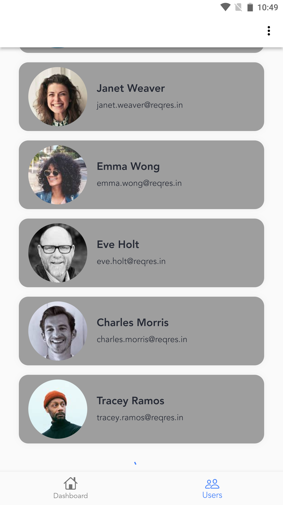
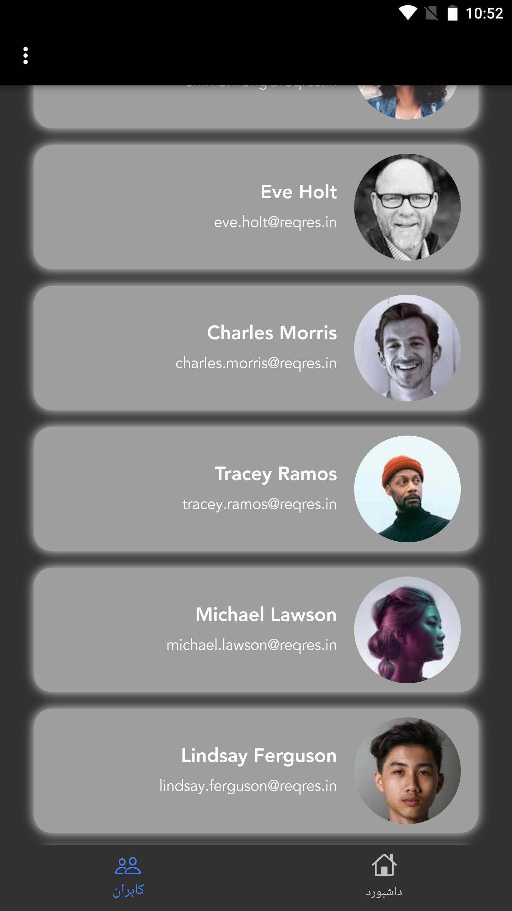
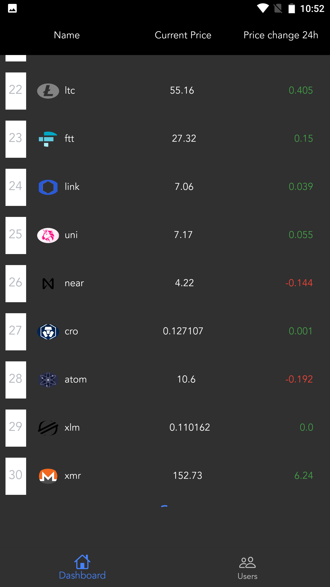
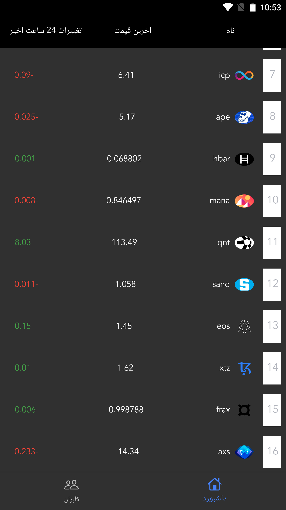
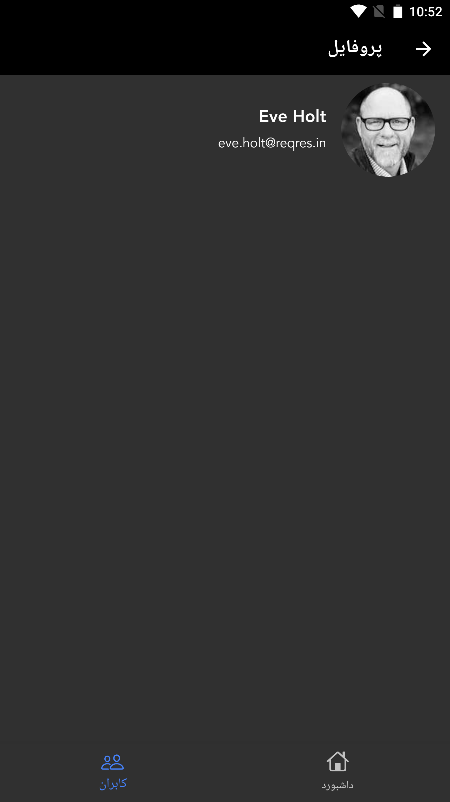

## Personal Challenge | Flutter

Create navigation like Instagram app navigation
Increase performance and reduce memory consumption when scrolling between pages.

Technologies

Technologies that are used in this projects are:

    Flutter
    Flutter Bloc
    Clean Architecture
    Dependency Injection
    Webview
    
Include internationalization & two theme 

## Screenshot

<table border>
    <tr>
        <th style="text-align:center">Splash Screen</th>
        <th style="text-align:center">Auth Screen | Log in</th>
        <th style="text-align:center">Auth Screen | Sign up</th>
    </tr>
    <tr>
        <td></td>
        <td></td>
        <td></td>
    <tr>
</table>

<table border>
    <tr>
        <th style="text-align:center">Users Screen | Loading</th>
        <th style="text-align:center">Users Screen | Paging</th>
        <th style="text-align:center">Users Screen | Dark Mode</th>
        <th style="text-align:center">Coins Screen | Paging</th>
    </tr>
    <tr>
        <td></td>
        <td></td>
        <td></td>
        <td></td>
    <tr>
</table>

<table border>
    <tr>
        <th style="text-align:center">Coins Screen | Other Locale</th>
        <th style="text-align:center">Profile Screen</th>
        <th style="text-align:center">Webview Screen</th>
    </tr>
    <tr>
        <td></td>
        <td></td>
        <td></td>
    <tr>
</table>
